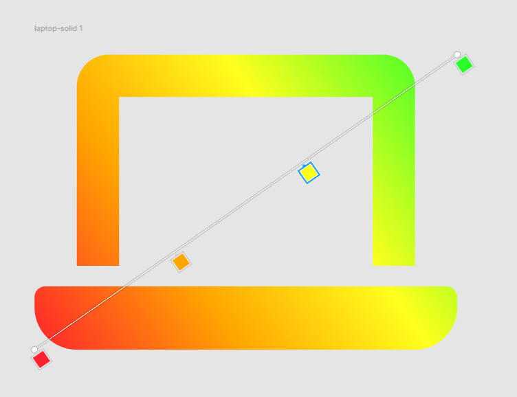

# This is emojis folder

## Emojis for HackBot

These icons are from [FontAwesome](https://fontawesome.com/)

I just added some gradient in [Figma](https://www.figma.com/)

**Emojis Table**

| Emoji Name                     | FontAwesome Icon Name                                                  |
| ------------------------------ | ---------------------------------------------------------------------- |
| [Host](./host.png)             | [laptop-solid](https://fontawesome.com/icons/laptop?s=solid)           |
| [Os](./os.png)                 | [windows-brands](https://fontawesome.com/icons/windows?s=brands)       |
| [Uptime](./uptime.png)         | [clock-regular](https://fontawesome.com/icons/clock?s=regular)         |
| [Resolution](./resolution.png) | [desktop-solid](https://fontawesome.com/icons/desktop?s=solid)         |
| [Cpu](./cpu.png)               | [microchip-solid](https://fontawesome.com/icons/microchip?s=solid)     |
| [Gpu](./gpu.png)               | [database-solid](https://fontawesome.com/icons/database?s=solid)       |
| [Memory](./memory.png)         | [ruler-solid](https://fontawesome.com/icons/ruler?s=solid)             |
| [Arrow](./arrow.png)           | [arrow-right-solid](https://fontawesome.com/icons/arrow-right?s=solid) |

The gradient is linear it looks like that:

### Hex colors for emojis:

Red: #FF222D

Orange: #FFA500

Yellow: #FFFF1D

Green: #2BFF2B

[Emojis.json](../src/utils/emojis.json)
